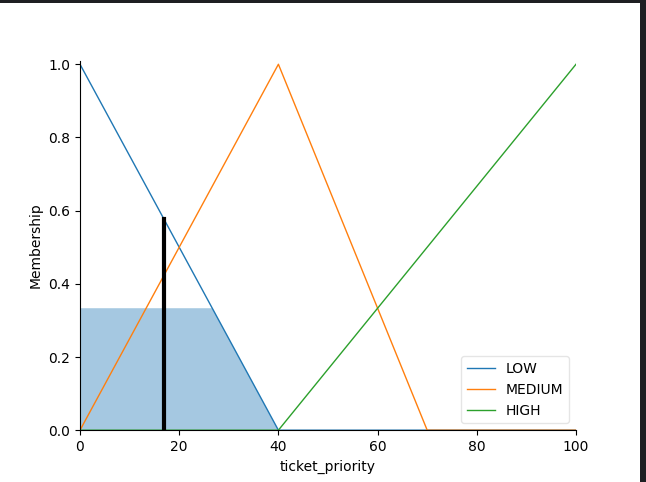
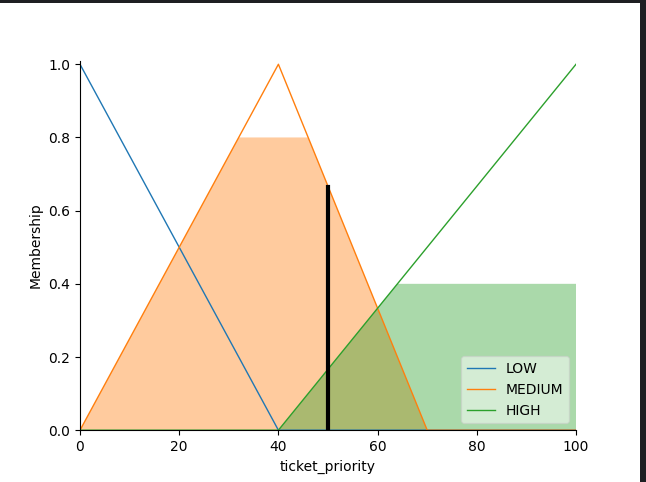
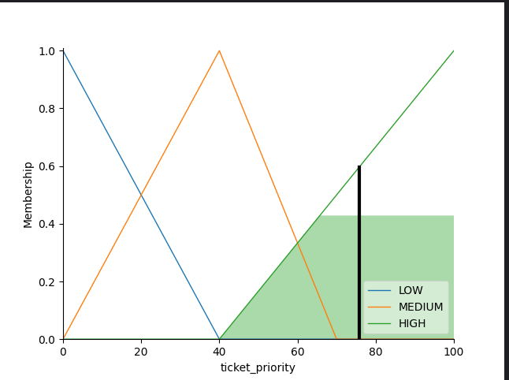

# Ticket Priority Fuzzy Logic System

This Python script implements a fuzzy logic system to determine the priority of a ticket based on customer importance, ticket severity, and ticket importance. The system uses triangular membership functions and specific rules to compute the ticket priority.

## Usage

1. Run the `ticket_priority_system.py` script.
2. Enter customer importance, ticket severity, and ticket importance when prompted.
3. The system will compute the ticket priority and display the result.

## Example Outputs

### Low Priority

### Medium Priority

### High Priority

## How It Works

The fuzzy logic system defines linguistic labels ('LOW', 'MEDIUM', 'HIGH') for input and output variables and uses triangular membership functions to model their relationships. Rules based on these labels determine the ticket priority level.

## Requirements

``pip install -r requirements.txt``

- NumPy
- scikit-fuzzy