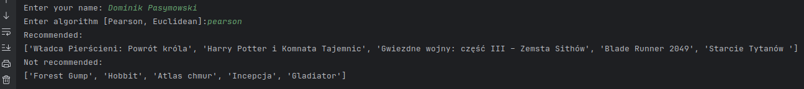

# Movie Recommendation Engine

## How to Use
1. Run the `main.py` script.
2. The program will prompt you to enter the name of the candidate for recommendations and ask for a correlation algorithm.
3. Viable candidate names are available in `data.json`.

Available Algorithms:
- Pearson
- Euclidean

## Examples

# Authors
- Dominik Pasymowski
- Michał Cichowski
